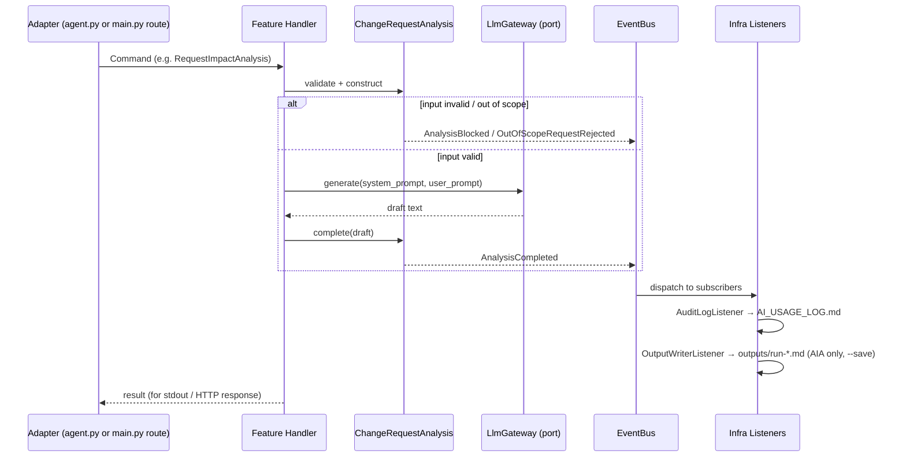

# Domain Model — DDD + Event-Driven Design

> Companion to [role-task.md](./role-task.md) and [agent-contract.md](./agent-contract.md). Describes the **shared domain** behind both applications in this repo — the AIA CLI (`agent.py`) and the ADA REST service (`../ada-service/`) — using DDD building blocks, and how they communicate via domain events (EDA). Code lives in `domain/`, `infra/`, and per-app `features/` (see [../README.md](../README.md#architecture-domain-infra--vertical-slices)).

## Bounded Context

**"Architecture Change Analysis"** — one bounded context, two applications (a CLI and a REST API) sharing the same domain language and building blocks, but each with its own vertical slices. They do not call each other; nothing here introduces coupling between the CLI and the API process.

## Ubiquitous Language

| Term | Meaning |
|---|---|
| **Change Request / Requirement** | Proposed system modification submitted for analysis (input) |
| **Module Map / As-Is Architecture** | Documented current-system context supplied alongside the request |
| **Draft** | An analysis output — always unapproved, always marked `DRAFT — Pending SA Review` |
| **Impact Analysis** | Affected modules/components/data flows |
| **NFR Checklist** | Non-functional requirement validation (SLA, latency, security, compliance) |
| **Risk Register** | Technical risks with likelihood/severity/mitigation |
| **Recommendation** | `PROCEED` \| `PROCEED_WITH_CAUTION` \| `ESCALATE` |
| **Assumption / Question** | A flagged gap the agent could not resolve from supplied inputs |
| **SA Review** | The human approval gate — the only thing that turns a Draft into a decision |

## Aggregates

### `ChangeRequestAnalysis` (root: `AnalysisId`)

The unit of work for one analysis run. Owns the validate → analyze → draft lifecycle; nothing outside this aggregate may set its `status` directly.

- **State:** `REQUESTED → BLOCKED | REJECTED | COMPLETED` (terminal; a new analysis is a new aggregate instance — no in-place "retry")
- **Invariants:**
  - Cannot reach `COMPLETED` without a `Draft` value object attached.
  - Cannot be constructed without a `subject` reference (missing subject ⇒ `BLOCKED`, never a null/partial aggregate).
  - Terminal states are immutable — mutating a finished analysis is a programming error, not a valid transition.
- **Behaviors:** `request()`, `block(reason)`, `reject(reason)`, `complete(draft)` — each raises the matching Domain Event below.

### `SolutionArchitectReview` (root: `ReviewId`, references `AnalysisId`)

Captures the human gate — mirrors [evidence/review-record.md](../evidence/review-record.md).

- **Invariant:** can only be created against a `ChangeRequestAnalysis` that is `COMPLETED` (you cannot review a blocked or rejected analysis — there's nothing to review).
- **Behaviors:** `approve()`, `reject()`, `request_revision()`.

## Value Objects (self-validating, immutable)

`AnalysisId`, `ChangeRequestRef(id, version, date)`, `ModuleMap`, `TechStack`, `Constraint`, `NfrItem(name, baseline, target, status)`, `RiskItem(id, description, likelihood, severity, mitigation, owner)`, `Assumption`, `Question`, `RecommendationStatus` (enum), `Draft(content, recommendation, assumptions, questions, risks, nfr_items)`.

`Draft` refuses to construct with empty `content` or a missing `recommendation` — the same rule that used to live implicitly in the output-schema prose in [agent-contract.md](./agent-contract.md) now lives in code.

## Domain Events (facts, past tense)

| Event | Raised by | Meaning |
|---|---|---|
| `AnalysisRequested` | `ChangeRequestAnalysis.request()` | A new analysis run started |
| `AnalysisBlocked` | `.block(reason)` | Input incomplete — cannot proceed (§ "Fallback & Escalation" in agent-contract.md) |
| `OutOfScopeRequestRejected` | `.reject(reason)` | Request asked for something outside agent boundaries (e.g. "approve this") |
| `PromptInjectionDetected` | raised alongside `AnalysisRequested`, non-blocking | Embedded instruction detected in input; analysis still proceeds honestly |
| `AnalysisCompleted` | `.complete(draft)` | Draft produced, ready for SA review |
| `AnalysisReviewed` | `SolutionArchitectReview.approve/reject/request_revision()` | SA recorded a decision |

## Event Flow (EDA)



Handlers never write files or print output directly — they call the aggregate and publish events. All side effects (logging, saving to disk) are **event listeners** in `infra/`, so adding a new side effect (e.g. a Slack notification on `ESCALATE`) means adding a new listener, not editing the handler.

## Commands → Vertical Slices

Each command is one slice; slices never call each other directly (see the skill's sharing rules — cross-slice communication only via Domain Event or Query).

| App | Command | Slice |
|---|---|---|
| AIA (`agent.py`) | `RequestImpactAnalysis(change_request_text)` | `features/request_impact_analysis/` |
| ADA (`ada-service/`) | `AnalyzeRequirement(requirement_id, requirement_doc, context)` | `ada-service/features/analyze_requirement/` |
| ADA | `RunGapImpactAnalysis(change_request_id, change_description, context)` | `ada-service/features/gap_impact_analysis/` |
| ADA | `DraftAdr(decision_title, context)` | `ada-service/features/draft_adr/` |

AIA has one command because its five test scenarios (`normal`, `incomplete`, `out_of_scope`, `prompt_injection`, `missing_source`) are the **same use case exercised with different inputs**, not different use cases — the aggregate's validation decides which event comes out, not the caller.

## Sharing Rules (per the skill)

```
Slices (Handlers)         ← no cross-slice calls, ever
Domain (domain/)          ← shared within this bounded context: aggregates, events, value objects, ports
Infra (infra/)            ← shared everywhere: EventBus, LlmGateway adapters, listeners
```

`domain/` and `infra/` are shared by **both** apps (AIA and ADA) because they're one bounded context; each app's `features/` are private to that app. This is why the Dockerfile for the ADA service now also copies `domain/` and `infra/`, not just `ada-service/main.py` (see [../Dockerfile](../Dockerfile)).

## Implementation Status

| Element | Status |
|---|---|
| `ChangeRequestAnalysis` aggregate, all 4 domain events, `EventBus`, `AuditLogListener`, `AnthropicGateway` | ✅ Implemented — `domain/`, `infra/` |
| `RequestImpactAnalysis` slice (AIA) | ✅ Implemented — `features/request_impact_analysis/` |
| `AnalyzeRequirement` / `RunGapImpactAnalysis` / `DraftAdr` slices (ADA) | ✅ Implemented — `ada-service/features/` |
| Deterministic pre-LLM validation (secrets reject, module-map block, injection flag) | ✅ Implemented — `domain/validation.py`, wired into every handler |
| `SolutionArchitectReview` aggregate | 📝 Modeled here, **not yet coded**. SA review is still a manual step — a human fills in [evidence/review-record.md](../evidence/review-record.md) by hand. Wiring `/api/v1/review` (ADA) and a CLI review command (AIA) to actually construct this aggregate and raise `AnalysisReviewed` is the natural next slice. |

## Why this over the old script-shaped code

| Before | After |
|---|---|
| `agent.py` / `main.py` did validation, prompt-building, API call, file I/O, and printing all inline | Handler orchestrates; Aggregate holds invariants; infra listeners own I/O |
| Adding an escalation type meant editing the one big function | Add an `Agg` behavior + event + listener; existing slices untouched |
| No enforced invariant on what makes an output "complete" | `Draft` value object refuses to exist without `content` + `recommendation` |
| Side effects (log, save) hardcoded at the call site | Side effects are subscribers — removable/addable independently |
